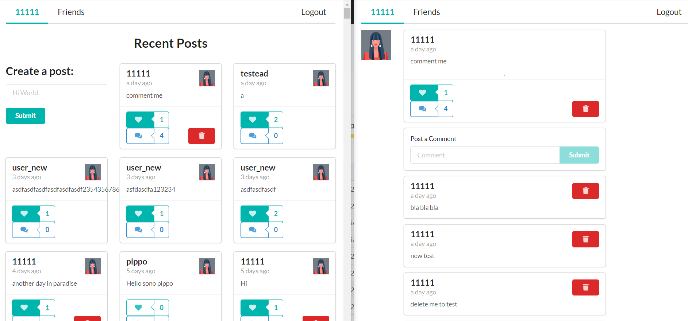

# Hooks + GraphQl + Semantic UI

Rede social com postagens, likes e comentarios. 

<p align="center">  </p>

## :checkered_flag: Passos para instalar o projeto 

Para rodar a aplicação, execute o comando: <br>

subir o backend (http://localhost:5000)

```console
cd..
cd graphql_apollo_hooks-backend
npm install
npm run start
``` 

subir o frontend
```console
npm install
npm run start
``` 
Em seguida, será aberto o endereço [http://localhost:3000](http://localhost:3000) em seu navegador.<br><br>


### :heavy_check_mark: Topicos abordados  
 - React-Hooks 
 - Custom Hook (useForm)
 - GraphQL com Apollo 
 - GraphQL querys/mutation
 - Semantic UI (para os elementos graficos)
 - Extensao Apollo Client Dev Tools chrome
 - Rota valida apenas autenticada <AuthRoute></AuthRoute>
 - Apollo link context (uma especie de middleware, para colocar token no header dos requests)


### :link: Links 
Algo que pode ser util.
 - [Video Classed parte  1](https://www.youtube.com/watch?v=_DqPiZPKkgY) 
 - [Video Classed parte  2](https://www.youtube.com/watch?v=I4FnYpCOjNI)  
 - [Video Classed parte  3](https://www.youtube.com/watch?v=C_2Eo72cL2k)  
 - [Video Classed parte  4](https://www.youtube.com/watch?v=JJaRTCRxOf4)  
 - [Video Classed parte  5](https://www.youtube.com/watch?v=ewLrGMt7MQY)  
 - [Video Classed parte  6](https://www.youtube.com/watch?v=F_SdB42DxdQ) 
 - [Video Classed parte  7](https://www.youtube.com/watch?v=wVORvTkowjQ) 
 - [Video Classed parte  8](https://www.youtube.com/watch?v=xzy-a526_Yk) 
 - [Video Classed parte  9](https://youtu.be/Ol2pXWQWhbg)
 - [Video Classed parte 10](https://www.youtube.com/watch?v=c-FZo25k1Io)
 - [Video Classed parte 11](https://www.youtube.com/watch?v=x-UFBhAPocI)
 - [Git](https://github.com/hidjou/classsed-graphql-mern-apollo)
 - [Playlist Backend GraphQL](https://www.youtube.com/playlist?list=PLMhAeHCz8S3_CTiWMQhL6YxX7vZ7z84Zo)

### :family: Usuarios teste:
 - roberto email: roberto@social.com s: 1234567
 - 11111   email: 11111@11111.com    s: 11111
 - 22222   email: 22222@22222.com    s: 22222

### :satellite:  Backend 
- Back-End Heroku: https://glacial-lake-96580.herokuapp.com/ 
 
### :satellite:  Repositorios Publicos
 - Back-End - local: C:\Users\Moacir\Documents\projetosCompartilhados\social-react-backend
 - Back-End - remoto: https://github.com/moacirjacomin/social-react-backend 
 - Front-End - local: C:\Users\Moacir\Documents\projetosCompartilhados\social-react-frontend
 - Front-End - remoto: https://github.com/moacirjacomin/social-react-frontend
 
 

 

### :blue_book: Documentacao  
 - [react semantic ui](https://react.semantic-ui.com/usage)
 

#
<footer>
  <p style="float:right; width: 30%;"> Copyright © Moacir Jacomin
</p>

